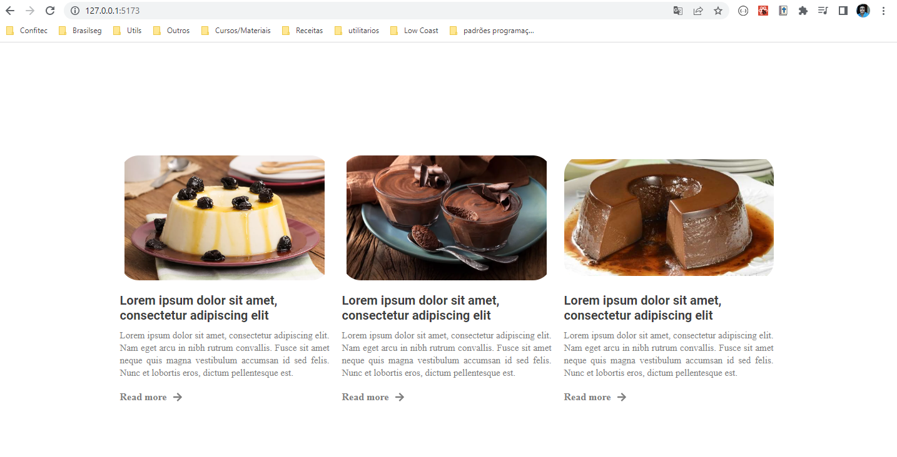

<h1 align="center">PTI - SPA</h1>

## 💻 O Projeto
Projeto desenvolvido para o trabalho da materia SPA, criação de um componente que recebe propriedades

<h1 align="center" class="teste">
  
</h1>

## Rodando o projeto
- Rode o comando `yarn` para instalar todas as dependências do projeto 
- Rode o comando `yarn vite dev` para rodar o projeto

## 🤔 Como contribuir

- Faça um fork desse repositório;
- Cria uma branch com a sua feature: `git checkout -b minha-feature`;
- Faça commit das suas alterações: `git commit -m 'feat: Minha nova feature'`;
- Faça push para a sua branch: `git push origin minha-feature`.

---

Desenvolvido por [William José Dias!](https://github.com/WilliamWJD)